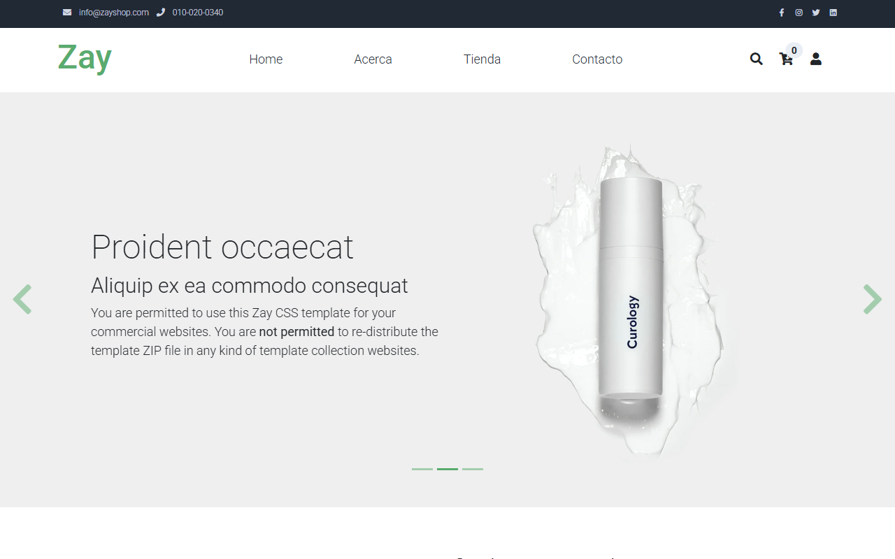
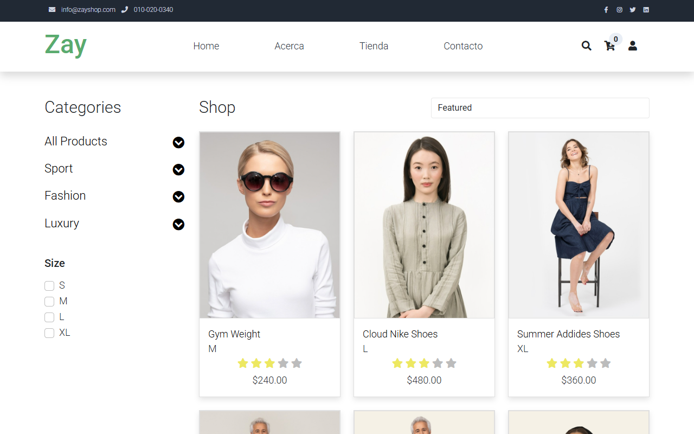
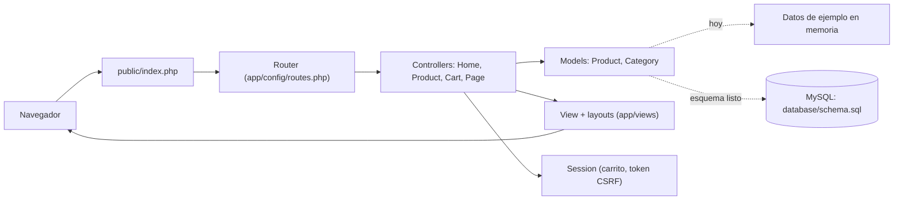

<div align="center">
  
  <h1>TiendaFlex</h1>
  <p><b>Catálogo de e-commerce sobre un mini-framework MVC en PHP puro, con carrito seguro en sesión.</b></p>
  
  
  
  <a href="https://github.com/Luiss2080/TiendaFlex/actions/workflows/ci.yml"></a>
  <p>
    <a href="#-inicio-rápido">Inicio rápido</a> ·
    <a href="#-características">Características</a> ·
    <a href="#️-arquitectura">Arquitectura</a> ·
    <a href="#-pruebas">Pruebas</a> ·
    <a href="#-lo-que-todavía-no-existe">Limitaciones</a>
  </p>
</div>

TiendaFlex es una tienda en línea hecha **sin Laravel ni Symfony**: un router con
parámetros, controladores, modelos sobre PDO, vistas con layouts y un carrito en
sesión que nunca confía en el precio que envía el navegador. Hoy el catálogo se
sirve desde **datos de ejemplo en memoria** y **no es una tienda completa**: no hay
cuentas, checkout ni pagos. Sirve como base de aprendizaje o portafolio.

## 🎬 Vista rápida

| Inicio | Tienda |
|:--:|:--:|
|  |  |

<sub>Capturas reales de la app local con los productos de ejemplo (plantilla TemplateMo "Zay").</sub>

## ✨ Características

| Característica | Detalle |
|---|---|
| Framework MVC propio | `Router` con parámetros (`shop/product/{id}`), `Request`, `Response`, `Controller`, `Model` sobre PDO y `View` con layouts, todo en `app/core/`. |
| Catálogo | Inicio, listado (`/shop`), ficha (`/shop/product/{id}`) y categoría (`/shop/category/{id}`). Datos de `Product::getSampleProducts()`; no necesita base de datos. |
| Búsqueda y orden | `/api/search` y ordenamiento por nombre A-Z/Z-A y precio ascendente/descendente. |
| Carrito en sesión | `/cart`, `/cart/add`, `/cart/update`, `/cart/remove`, `/api/cart/count`. El precio se resuelve **siempre en el servidor** desde el `product_id`; la cantidad se limita a 1-100 por artículo. |
| CSRF | Token por sesión verificado en las peticiones POST del carrito y del contacto. |
| Contacto | `/contact` valida en servidor y guarda el mensaje en `logs/contact.log`; no envía correo. |
| SQL parametrizado | El acceso a datos usa sentencias preparadas de PDO. |
| Subida de archivos | `upload_file()` valida extensión (lista blanca) y tipo MIME real. Aún no está conectada a ningún formulario. |

## 🏗️ Arquitectura



## 🚀 Inicio rápido

| Requisito | Versión |
|---|---|
| PHP | 7.4 o superior (probado en local con 8.5) |
| Servidor | Apache con `mod_rewrite` (Laragon/XAMPP) o el servidor embebido con el router de abajo |
| MySQL | Opcional: solo si vas a usar el esquema real |

1. Clona el repositorio y crea tu configuración:
   ```bash
   git clone https://github.com/Luiss2080/TiendaFlex.git
   cd TiendaFlex
   cp .env.example .env
   ```
2. Ajusta `APP_URL` en `.env` a la URL desde la que vas a servir el sitio. **Es importante**: los enlaces a CSS/JS/imágenes se generan como `APP_URL/public/...`.
3. Sirve la carpeta **raíz** del proyecto con Apache (el `.htaccess` redirige todo a `public/index.php`), por ejemplo en Laragon como `http://tiendaflex.test`. No lo probé con Apache; sí con el servidor embebido (abajo).
4. Abre `/`, `/shop`, `/shop/product/1`, `/cart` y `/contact`.

<details>
<summary>Alternativa: servidor embebido de PHP (verificado en local)</summary>

`php -S ... -t public` **no sirve** los estilos, porque los enlaces apuntan a `/public/...`. Un router mínimo, fuera del repositorio (por ejemplo `router-dev.php`), lo resuelve:

```php
<?php
$root = __DIR__;              // raíz de TiendaFlex
$path = parse_url($_SERVER['REQUEST_URI'], PHP_URL_PATH);
if ($path !== '/' && is_file($root . $path)) { return false; } // archivos estáticos
chdir($root . '/public');
require $root . '/public/index.php';
```

```bash
# con APP_URL=http://localhost:8000 en .env
php -S localhost:8000 -t . router-dev.php
```

</details>

<details>
<summary>Variables de entorno (<code>.env.example</code>)</summary>

| Variable | Uso |
|---|---|
| `APP_NAME`, `APP_URL`, `APP_ENV`, `APP_DEBUG` | Datos de la aplicación; `APP_URL` construye los enlaces a assets |
| `SESSION_LIFETIME`, `SESSION_NAME` | Sesión (por defecto 7200 s) |
| `DB_HOST`, `DB_PORT`, `DB_NAME`, `DB_USER`, `DB_PASS`, `DB_CHARSET` | Solo si consultas MySQL real; el catálogo de ejemplo no las necesita |

Para crear el esquema: `mysql -u root -p < database/schema.sql` (crea la base `zay_shop`). Ningún flujo actual del sitio depende de ella.

</details>

<details>
<summary>Estructura de carpetas</summary>

```
app/
  config/routes.php     # tabla de rutas
  controllers/          # Home, Product, Cart, Page
  core/                 # Router, Request, Response, Controller, Model, Database, Session, View
  helpers/functions.php # env(), CSRF, upload_file(), etc.
  models/               # Product, Category
  views/                # layouts, home, products, cart, pages, errors
config/                 # app.php, database.php
database/schema.sql     # esquema MySQL (aún sin conectar al catálogo)
public/                 # index.php, css, js, img, webfonts
tests/                  # runner propio (php tests/run.php)
```

</details>

## 🧪 Pruebas

```bash
php tests/run.php     # o: composer test
```

Runner propio, sin PHPUnit ni `composer install`. Hay **17 pruebas** (todas pasan) que cubren tokens CSRF, paso de parámetros de ruta al controlador, rechazo de archivos que no son imágenes reales (incluido un script PHP disfrazado) y cálculo del carrito ignorando precios manipulados. El workflow `.github/workflows/ci.yml` ejecuta `php -l` y la suite en PHP 7.4, 8.1, 8.2 y 8.3.

## 🔒 Seguridad

- CSRF por sesión en las operaciones POST del carrito y del contacto.
- Precio y nombre del carrito se toman del catálogo del servidor, nunca del cliente.
- Consultas con sentencias preparadas de PDO.
- Subida de archivos con lista blanca de extensiones y verificación del MIME real.
- Cookie de sesión con `httponly` y `SameSite=Lax`; `secure` está en `false` en `config/app.php` y debe activarse bajo HTTPS.
- `.env` está en `.gitignore`; no subas credenciales reales.

## 🚧 Lo que todavía no existe

- Autenticación, cuentas de usuario y panel de administración: el icono de usuario y el menú son solo interfaz.
- Checkout, pagos y pedidos: el carrito calcula totales, pero no hay flujo de compra.
- Catálogo en MySQL: `database/schema.sql` define productos, pedidos, pagos y reseñas, pero el sitio usa datos de ejemplo; los métodos de `Product` con SQL no están conectados a las páginas.
- Envío de correo desde el formulario de contacto (solo escribe en `logs/contact.log`).
- Textos e imágenes provienen de una plantilla de terceros (Zay/TemplateMo) y siguen en parte en inglés; la zona horaria por defecto es `America/Mexico_City`.
- El servidor embebido de PHP con `-t public` no carga estilos sin el router descrito arriba.

## 📄 Licencia

Sin licencia definida: todos los derechos reservados por defecto. La plantilla visual original pertenece a TemplateMo.

<div align="center"><sub>Hecho por Luiss2080 · PHP puro, sin frameworks</sub></div>
